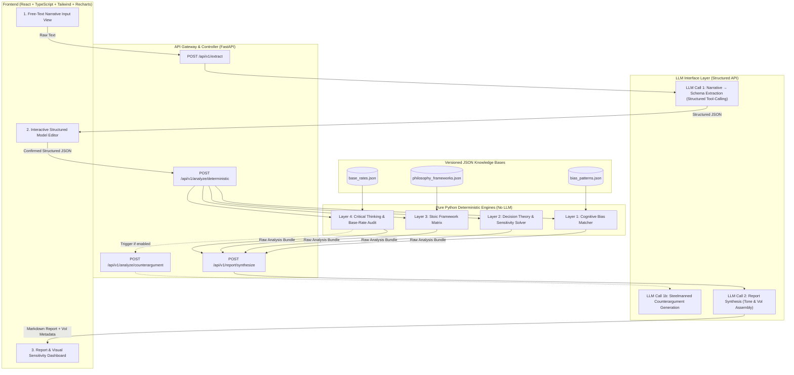
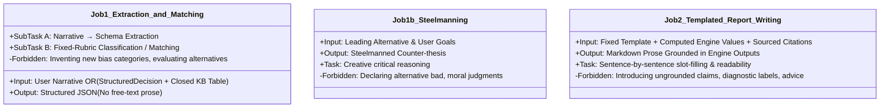
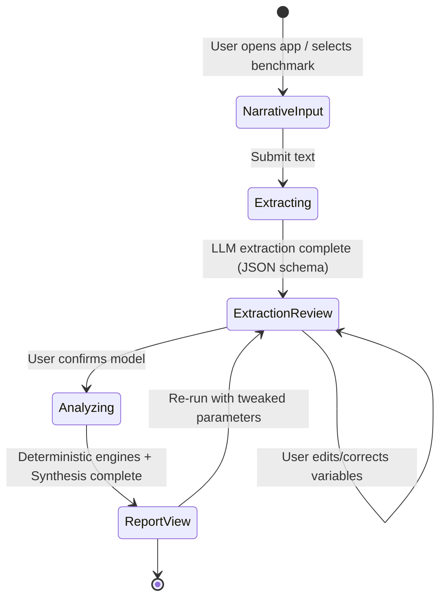
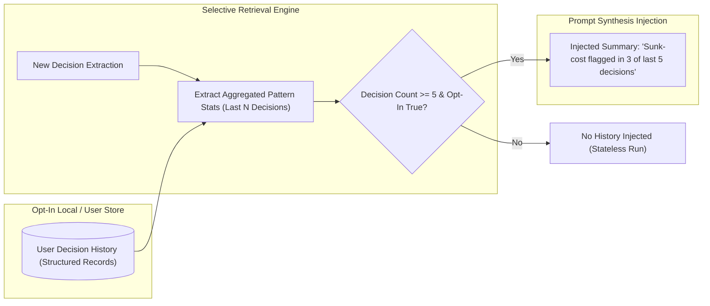

# System Architecture & Technical Design — Phronesis

## 1. System Architecture Overview

Phronesis is engineered around a strict separation of concerns between **non-deterministic natural language processing** (handled by LLMs) and **deterministic analytical computation** (handled by pure Python modules).



---

## 2. LLM Role Decomposition & Strict Prompt Constraints

To guarantee auditability and eliminate hallucinations, the LLM is restricted to **two highly constrained, non-generative jobs** (plus one isolated steelmanning sub-call). The LLM is never permitted to invent categories, give advice, or make claims outside the computed data.



### Detailed Job Specifications:

#### Job 1: Extraction & In-Context Rubric Matching
1. **Extraction:** Receives free-text narrative; parses it strictly into the `StructuredDecision` JSON schema.
2. **Fixed-Rubric Classification / Matching:** The LLM receives the **closed, fixed, git-versioned knowledge-base lookup table** (`bias_patterns.json`, `philosophy_frameworks.json`) alongside the confirmed `StructuredDecision`. It is prompted as an in-context classifier:
   - *Prompt Constraint:* "Score which of the fixed $N$ entries in the provided lookup table match the reasoning exhibited in the structured decision object. You are strictly forbidden from inventing new categories, psychological concepts, or names outside the provided list."
   - *Output:* Array of matched entry IDs with the verbatim trigger phrases and the pre-defined `question_to_surface`.

#### Job 1b: Steelmanned Counterargument Generation (Isolated Sub-piece)
- Operates within the Critical Thinking Layer. Receives the leading alternative and user goals; generates the strongest coherent opposing argument to stress-test the option.

#### Job 2: Templated Report Writing
- Receives a **fixed report template** with all computed values already populated (EU figures, Minimax Regret choice, algebraic sensitivity threshold $p^*$, flagged bias IDs with `field` and `source`, Stoic dichotomy mapping, VoI experiment).
- *Prompt Constraint:* "Turn the supplied structured findings into clean, readable markdown. Every single sentence you write must trace directly to a field or value in the input payload. You are strictly forbidden from adding extraneous advice, life recommendations, or psychological diagnoses."
- *Attribution Enforcement:* Every flagged insight is rendered with its intellectual lineage (e.g. *"Source: Behavioral Economics — Loss Aversion (Kahneman & Tversky)"*).

---

## 3. Module Breakdown & Analysis Layer Design

### 3.1 Layer 1: Cognitive Bias Engine (`app/engines/bias_engine.py`)
- **Input:** `StructuredDecision`, `bias_patterns.json` (Human-curated, static lookup table with `field` and `source`).
- **Methodology:**
  - Evaluates decision variables (historical investments, loss deltas, probability skews) against the closed lookup table via hybrid predicate matching and constrained LLM classification.
- **Output:** Flagged patterns with attribution metadata (`field`, `source`, `core_idea`, `observed_trigger`, `question_to_surface`).

### 3.2 Layer 2: Decision Theory & Math Engine (`app/engines/math_engine.py`)
- **Input:** Alternatives $A = \{a_1, \dots, a_n\}$, States $S = \{s_1, \dots, s_m\}$, Probabilities $P = [p_1, \dots, p_m]$, Payoff Matrix $U \in \mathbb{R}^{n \times m}$.
- **Pure Functions:**
  1. **Expected Utility Vector:**
     $$\mathbf{EU} = U \cdot \mathbf{p}$$
  2. **Minimax Regret Matrix:**
     $$U^*_j = \max_{i} U_{i,j} \quad \forall j$$
     $$R_{i,j} = U^*_j - U_{i,j}$$
     $$\mathbf{MR}_i = \max_{j} R_{i,j}$$
     $$a^*_{\text{regret}} = \arg\min_i \mathbf{MR}_i$$
  3. **Sensitivity Analysis & Algebraic Inflection Derivation:**
     For a 2-state, 2-alternative dilemma where $a_1$ is preferred over $a_2$ ($EU(a_1) > EU(a_2)$):
     $$p_1 U(a_1, s_1) + (1-p_1) U(a_1, s_2) = p_1 U(a_2, s_1) + (1-p_1) U(a_2, s_2)$$
     Solving for the exact flipping probability threshold $p_1^*$:
     $$p_1^* = \frac{U(a_2, s_2) - U(a_1, s_2)}{\left(U(a_1, s_1) - U(a_1, s_2)\right) - \left(U(a_2, s_1) - U(a_2, s_2)\right)}$$

### 3.3 Layer 3: Philosophy Engine (`app/engines/philosophy_engine.py`)
- **Input:** `StructuredDecision`, `philosophy_frameworks.json` (`field: hellenistic_philosophy`, `source: Epictetus, Enchiridion`).
- **Stoic Lens Processing:**
  1. **Dichotomy of Control Taxonomy:** Evaluates tokens and predicates in `assumptions` and `unknowns` against internal vs. external control categories.
  2. **Preferred vs. Dispreferred Indifferents Matrix:** Distinguishes core virtues (reason, discipline, character growth) from indifferent outcomes (wealth, title, comfort, social approval).
  3. **Reflective Tension Output:** Identifies where user reasoning ties peace of mind to external indifferents rather than internal agency.

### 3.4 Layer 4: Critical Thinking Engine (`app/engines/critical_thinking_engine.py`)
- **Input:** `StructuredDecision`, `base_rates.json`
- **Methodology:**
  1. **Falsifiability Audit:** Evaluates each assumption for empirical testability criteria ($1 = \text{Verifiable metric within 30 days}$; $0 = \text{Unverifiable subjective forecast}$).
  2. **Base-Rate Comparison:** Matches user state definitions against empirical reference classes (e.g. startup financing rates, job search durations) and calculates divergence $\Delta = |P_{\text{user}} - P_{\text{base\_rate}}|$.
  3. **Steelmanning Invocation:** Passes leading alternative to LLM Call 1b to generate targeted counter-thesis.

---

## 4. Frontend Component Hierarchy & State Machine



### Key Frontend Views (`frontend/src/features/`):
1. `InputView`: Free-text prompt input area with word counter, clarity guidance, and "Load Benchmark Scenario" quick-picks.
2. `ModelEditorView`:
   - Interactive matrix table (Alternatives $\times$ States) for direct payoff manipulation.
   - Interactive probability slider with automatic normalization ($\sum p_i = 1.0$).
   - Editable chips for assumptions, goals, and constraints.
3. `ReportView`:
   - **VoI Hero Banner:** Highlighting the highest-leverage cheap test.
   - **Recharts Sensitivity Chart:** Interactive line chart illustrating $EU$ curves intersecting at $p_1^*$.
   - **Regret Matrix Heatmap:** Visualizing where maximum psychological risk concentrates.
   - **Structured Markdown Report:** Caveat-compliant narrative tabs with source attributions.

---

## 5. Error Handling, Validation, & Guardrail Strategy

### 5.1 Extraction Schema Validation
- Uses Pydantic v2 `TypeAdapter` and strict response formatting.
- If JSON parsing fails or required fields are absent, automated fallback prompts retry with explicit error diagnostics up to 2 attempts before surfacing manual recovery UI.

### 5.2 Deterministic Engine Invariant Checks
- **Probability Normalization Guard:** If user manual edits result in $\sum p_j \neq 1.0$, the math engine automatically normalizes $p_j' = \frac{p_j}{\sum p_k}$ and displays a warning banner.
- **Payoff Clamping:** Payoffs are clamped strictly to $[0, 100]$.

### 5.3 Two-Stage Post-Synthesis Guardrail Pipeline
Before returning the final synthesis report to the frontend, the output passes through a two-stage defense in depth to enforce the Non-Negotiable Boundaries ("Must Nevers"):

#### Stage 1: Fast Regex / Lexicon Linter
A fast first-pass filter catches prescriptive phrasing, near-miss advice, diagnostic labels, and composite scoring:
```python
FORBIDDEN_PRESCRIPTIVE_PATTERNS = [
    # Direct prescriptive directives & advice
    r"\byou\s+should\s+(choose|pick|select|decide|pursue|opt|take|go\s+with)\b",
    r"\byou\s+must\s+(choose|pick|select|decide|pursue|opt|take|go\s+with)\b",
    r"\bought\s+to\b",
    r"\b(it\s+would\s+be\s+|is\s+)?prudent\s+to\b",
    r"\b(the\s+)?wiser\s+(path|choice|decision|option|course|way|alternative)\b",
    r"\bwiser\s+to\b",
    r"\bwe\s+recommend\s+that\s+you\b",
    r"\bi\s+recommend\s+(that\s+)?you\b",
    r"\b(i|we)\s+(strongly\s+)?(advise|recommend)\b",
    r"\badvise(s)?\s+(you|that\s+you|to)\b",
    r"\brecommend(s|ed)?\s+(that\s+)?(you|pursuing|choosing|selecting|taking)\b",
    r"\b(my|our)\s+recommendation\s+is\b",
    r"\bthe\s+only\s+logical\s+(choice|decision|option|path)\b",

    # Declaring winners / objective superiority
    r"\bthe\s+(correct|optimal|best|better|superior|recommended|wiser)\s+(choice|decision|option|path|course|alternative)\s+is\b",
    r"\bclearly\s+(the\s+best|the\s+superior|comes\s+out\s+ahead|wins|dominates)\b",
    r"\b(is|comes\s+out)\s+(as\s+)?clearly\s+superior\b",

    # Diagnostic & personality labeling
    r"\byou\s+have\s+(the\s+|a\s+)?[a-z\-]+\s+(bias|fallacy|tendency)\b",
    r"\byou\s+(are\s+suffering|suffer)\s+from\b",
    r"\byou\s+(are\s+exhibiting|exhibit)\s+(the|a)\b",
    r"\btextbook\s+(case|example|pattern)\s+of\b",
    r"\bclassic\s+([a-z\-]+\s+)*(case|example|pattern)\b",
    r"\b(a\s+)?classic\s+[a-z\-]+\s+pattern\b",
    r"\bexhibiting\s+a\s+classic\b",

    # Arbitrary scalar scoring / composite index
    r"\bscore:?\s+\d+/\d+\b",
    r"\brating:?\s+\d+/\d+\b",
    r"\bcomposite\s+score:?\s+\d+\b"
]
```

#### Stage 2: Constrained LLM Boundary Audit Backstop
To protect against open-ended natural language paraphrases that evade regex matching, a second constrained LLM pass evaluates the generated markdown against the 5 Non-Negotiable Boundaries:
1. *Never State a Diagnosis* (observational patterns only, no personal labeling)
2. *Never Claim Mathematical Prescriptiveness* (heuristics, not life proofs)
3. *Never Collapse to a Single Score* (no scalar ratings)
4. *Never Privilege a Single Philosophical School* (parallel lenses)
5. *Never Assert Psychological Certainty* (hypotheses to inspect)

The LLM is constrained to returning strictly structured JSON: `{"passed": boolean, "offending_sentence": string, "violation_reason": string}`.

#### Fail-Safe Behavior
If a violation is flagged at either Stage 1 or Stage 2, the pipeline fails safe to `ReportGuardrail.generate_fallback_template(bundle)`, rendering a 100% deterministic structured markdown template from the verified analytical layer outputs.

---

## 6. Personalization & Memory Layer (Retrieval-Based, Opt-In)
> **Design Status:** Fully Architected Data Model  
> **Scope Designation:** Fast-Follow / V2 Roadmap (Deferred from V1 Core)

The personalization layer is designed as a **selective retrieval-based memory system**, not a context-window expansion. It allows the reasoning engine to detect longitudinal cognitive habits without accumulating an unbounded conversational transcript.



### 6.1 Core Architectural Principles
1. **Retrieve Structured Summaries, Never Raw Logs:** The system never dumps full past narratives or transcripts into the LLM context. Instead, it computes concise, structured summary counts (e.g., *"Flagged sunk-cost signals in 3 of last 5 decisions; historically estimated startup success at 40% vs 20% base rate"*).
2. **Threshold-Gated Pattern Surfacing ($\ge 5$ Decisions):** Cross-decision pattern insights are never triggered on 1-2 data points. A pattern is only surfaced once $\ge 5$ decisions have been logged, preventing premature pattern-matching.
3. **Caveat Language for History:** Cross-decision patterns are communicated with observational neutrality: *"This pattern has recurred across your last $N$ decisions,"* never as a personality diagnosis (*"You are risk-averse"*).
4. **Explicit Consent & Sovereign Data Control:**
   - **Opt-In by Default:** History tracking is disabled unless explicitly enabled in user settings.
   - **Export & Purge:** Users can view, download as a single `history.json` export, or permanently wipe their decision records at any time with a single click.

---

## 7. Frontend UI/UX Specification & Design System

### 7.1 Visual Identity & Structural Language
Phronesis borrows the disciplined structural language of modern AI chat products (minimal chrome, generous whitespace, calm typography, centered reading column of max-width ~720px, restrained purposeful motion) while establishing its own distinct visual identity grounded in practical wisdom, antiquity, and mathematical rigor.

```
┌───────────────┬────────────────────────────────────────┐
│  Sidebar      │              Main column               │
│  (collapsible)│        (max-width ~720px,              │
│               │         centered, generous margin)     │
│  Past         │                                        │
│  decisions    │   [Decision input / extraction-confirm │
│  (history)    │    / report — one flow, three states]  │
│               │                                        │
│  + New        │                                        │
│  decision     │                                        │
└───────────────┴────────────────────────────────────────┘
```

### 7.2 Named Color Token System
The color palette is grounded in antiquity, stone, ink, aged bronze patina, and illuminated manuscripts:

```css
--color-marble:    #EAE6DD;  /* Light-mode background — cool stone, not yellow cream */
--color-ink:       #1B1F22;  /* Primary text on light; dark-mode background */
--color-parchment: #F5F2EA;  /* Light-mode card surfaces; dark-mode text */
--color-verdigris: #5B7A6B;  /* Primary accent — aged bronze patina */
--color-ochre:     #B8863B;  /* Secondary accent — used ONLY for Value-of-Information callouts */
--color-slate:     #8A8578;  /* Borders, dividers, muted UI chrome */
```

- **Light Mode:** Marble background (`#EAE6DD`), Ink text (`#1B1F22`), Parchment surfaces (`#F5F2EA`), Verdigris interactive buttons/links, Ochre reserved exclusively for VoI callouts.
- **Dark Mode:** Ink background (`#15181B`), Parchment text (`#F5F2EA`), Verdigris and Ochre accents maintained.

### 7.3 Three-Role Typography Hierarchy
1. **Display** (`Fraunces`): Headings, section labels, and Greek subtitles (`φρόνησις`). Used with restraint; never for body paragraphs.
2. **Body** (`Source Serif 4` & `IBM Plex Sans`): `Source Serif 4` for report text and reflective prose (sustained reading); `IBM Plex Sans` for UI chrome, navigation, buttons, and form labels.
3. **Utility/Data** (`JetBrains Mono` / `IBM Plex Mono`): Strictly and only for deterministic numbers (expected utility values, state probabilities, sensitivity thresholds $p^*$, minimax regret scores), visually demarcating computed functions from prose.

### 7.4 Three Flow States
1. **Input State:** A single centered prompt to describe the decision once (not a multi-turn chat composer), accompanied by canonical benchmark dilemma pickers.
2. **Extraction-Confirm State:** Structured data calibration cards (decision statement, alternatives, payoff utility sliders, prior probabilities with auto-normalization, stated assumptions, goals, constraints).
3. **Report State:** Distinct un-numbered cards in fixed vertical order representing independent parallel lenses (Psychology, Decision Theory, Hellenistic Philosophy, Critical Thinking, Sourced Attributions), topped with the signature Ochre VoI experiment banner.

### 7.5 Signature Element: Balance-Scale Sensitivity Visualizer
An interactive balance scale simulating decision sensitivity:
- Central fulcrum with an authentic tilting crossbeam that physically rotates in real-time as the probability slider $P(S_1)$ moves.
- Counter-rotated pans holding competing alternatives with live expected utilities rendered in monospace.
- Ochre-marked inflection point $p^*$ showing the exact threshold where decision judgment tips from one option to the other.

### 7.6 Engineering Standards
- Responsive collapse: desktop collapsible sidebar (`md:w-64` / `md:w-16`), mobile slide-over drawer with backdrop.
- Focus states: High-visibility `:focus-visible` rings with Verdigris accent on all interactive controls.
- Motion restraint: Respects `prefers-reduced-motion` with instant transitions and zero superfluous decorative animations.


