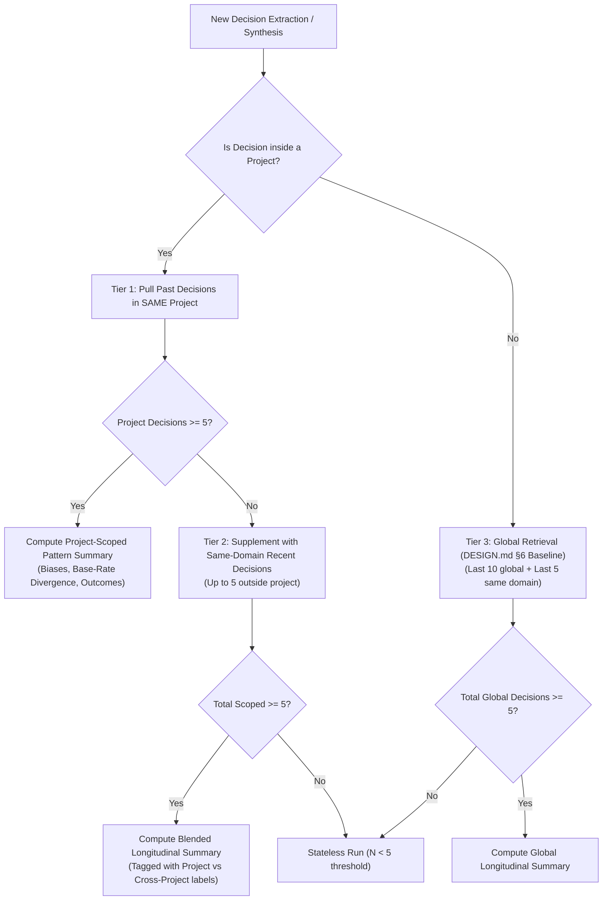

# Models, Effort Selector & Projects Plan (V2 Integration)

> **Document Status:** Complete Architecture & Design Specification  
> **Core Axiom:** The deterministic analysis pipeline, two-stage guardrail audit pass, and non-prescriptive boundaries (`DESIGN.md` §5) are **never** altered, skipped, or downgraded by any model, effort setting, or project container.

---

## 1. Model Picker — Provider & Model Selection

### 1.1 Current Architecture & Grounding
[`backend/app/services/llm_client.py`](backend/app/services/llm_client.py) already supports four providers:
1. **Gemini:** `gemini-2.5-flash`, `gemini-2.5-pro`
2. **OpenAI:** `gpt-4o-mini`, `gpt-4o`
3. **Anthropic:** `claude-3-5-sonnet-20241022`, `claude-3-7-sonnet`
4. **Offline / Mock:** Pure Python deterministic extraction and templating fallback

Currently, provider and model selection are bound to environment variables in `config.py` (`LLM_PROVIDER`, `LLM_MODEL`, `LLM_API_KEY`). LLM operations in Phronesis are strictly bounded to:
- **Narrative Extraction (LLM Call 1):** Natural language narrative → `StructuredDecision` JSON schema.
- **Steelmanned Counterargument (LLM Call 1b):** Dialectical stress-test of the leading option.
- **Report Synthesis (LLM Call 2):** Formatting verified deterministic engine results into structured markdown.
- **Boundary Audit (Stage 2 Guardrail):** JSON classification against non-negotiable boundaries.

Because changing the model alters only translation fluency/speed and not the underlying deterministic mathematical computation, exposing model selection to the user is safe, transparent, and empowers user autonomy.

### 1.2 UI Placement — Inline Composer Pill
The Model Picker is placed **inside the input prompt capsule** in [`NarrativeInputView.tsx`](frontend/src/features/input/NarrativeInputView.tsx), in the bottom action bar directly adjacent to the Effort Selector and Submit button.

```
┌─────────────────────────────────────────────────────────────────────────────┐
│  Describe Your Dilemma Once                                      742 chars  │
│  ┌───────────────────────────────────────────────────────────────────────┐  │
│  │ I am deciding whether to remain in my stable enterprise software      │  │
│  │ engineering job ($190k base + $120k unvested RSUs) or join an         │  │
│  │ early-stage AI startup as a founding engineer...                      │  │
│  └───────────────────────────────────────────────────────────────────────┘  │
│  ⚡ Include alternatives, unknowns, payoffs.                                 │
│                                                                             │
│  [📁 Project: Career Pivot ▾]  [✨ Gemini Flash ▾] [⚡ Standard ▾]  [Extract →]│
└─────────────────────────────────────────────────────────────────────────────┘
```

**Design & Visual Tokens:**
- Built using existing design tokens (`var(--bg-surface)`, `var(--border-subtle)`, `var(--text-main)`, `var(--color-verdigris)`).
- **Trigger:** A compact pill displaying the provider icon, human-readable model name, and a subtle chevron.
- **Dropdown Menu:**
  - Categorized by provider (Google Gemini, OpenAI, Anthropic, Offline Fallback).
  - Status indicator showing whether an API key is configured on the backend (`has_key: boolean`).
  - Active model marked with a Verdigris checkmark (`✓`).
  - Zero-key "Deterministic Offline Fallback" always accessible.
- **Persistence:** User selection persists in `localStorage` (`phronesis_preferred_model`) and is passed per-request.

### 1.3 Per-Request Provider & Model Flow
1. **API Discovery (`GET /api/v1/models`):**  
   Returns the catalog of supported models along with server-side key availability flags:
   ```json
   {
     "models": [
       {"provider": "gemini", "model": "gemini-2.5-flash", "label": "Gemini 2.5 Flash", "has_key": true, "is_default": true},
       {"provider": "gemini", "model": "gemini-2.5-pro", "label": "Gemini 2.5 Pro", "has_key": true, "is_default": false},
       {"provider": "openai", "model": "gpt-4o-mini", "label": "GPT-4o Mini", "has_key": true, "is_default": false},
       {"provider": "openai", "model": "gpt-4o", "label": "GPT-4o", "has_key": true, "is_default": false},
       {"provider": "anthropic", "model": "claude-3-5-sonnet-20241022", "label": "Claude 3.5 Sonnet", "has_key": false, "is_default": false},
       {"provider": "mock", "model": "deterministic", "label": "Offline Deterministic", "has_key": true, "is_default": false}
     ]
   }
   ```
2. **Request Schema (`LLMConfigOverride`):**
   ```python
   class LLMConfigOverride(BaseModel):
       provider: Optional[str] = None   # "gemini" | "openai" | "anthropic" | "mock"
       model: Optional[str] = None      # e.g., "gemini-2.5-pro"
   ```
3. **Threading Through Services:**
   - `ExtractionService.extract_structured_decision(narrative, llm_config, project_context)`
   - `SynthesisService.synthesize_report(bundle, llm_config)`
   - `CounterargumentService.generate_counterargument(decision, leading_alt_id, llm_config)`
   - `LLMClient.generate_structured_json()`, `generate_text()`, and `audit_report_boundaries()` accept `llm_config: Optional[LLMConfigOverride] = None` and override singleton settings for that request.

---

## 2. Effort Selector & Depth Control Relationship

### 2.1 Decided Architecture: Coarse Effort Presets + Fine Focus Mode Override
Rather than creating two competing depth systems, **Effort** and **Focus Mode** are cleanly decoupled along orthogonal dimensions:

- **Effort Level (Compute & Verbosity Budget):** Sets the global breadth and detail profile across the entire synthesis pass.
- **Focus Mode (Topical Foregrounding):** Directs which specific analytical lenses receive expanded emphasis and immediate visual prominence.

```
┌─────────────────────────────────────────────────────────────────────────────┐
│                          COARSE EFFORT PRESET                               │
│                   (Quick Pass / Standard / Thorough Pass)                   │
│                                                                             │
│  Controls global synthesis detail, counterargument depth, and drill-downs  │
└──────────────────────────────────────┬──────────────────────────────────────┘
                                       │
                         Sets baseline layer depth budget
                                       │
┌──────────────────────────────────────▼──────────────────────────────────────┐
│                        FINE FOCUS MODE OVERRIDE                             │
│       (Focused Layers: Psychology / Logic / Philosophy / Practical)         │
│                                                                             │
│  Explicitly requested focus layers are promoted to FULL regardless of budget│
└─────────────────────────────────────────────────────────────────────────────┘
```

### 2.2 Concrete Effort Level Specifications

| Dimension | Quick Pass (`quick`) | Standard (`standard`, Default) | Thorough Pass (`thorough`) |
|---|---|---|---|
| **Deterministic Math & Engine Run** | 100% Full Execution (<20ms) | 100% Full Execution (<20ms) | 100% Full Execution (<20ms) |
| **Synthesis Text Density** | Crisp 1–2 sentence bullet points per section | Full multi-paragraph structured synthesis | Extended deep-dive narrative with nuanced dialectic tension |
| **Counterargument Depth** | Skipped for latency (<1s response) | 1 steelmanned counterargument on leading alternative | 2 counter-theses (top-2 alternatives by Expected Utility) |
| **Philosophy Exposure** | 1 core agency tension summary | Active/foregrounded framework deep-dives | All 4 philosophical lenses receive complete multi-paragraph analysis |
| **Drill-Down Content** | On-demand only (lazy loaded) | On-demand only | Proactive pre-generation for top flagged items |
| **Stage 1 Regex Guardrail** | **MANDATORY (100% Active)** | **MANDATORY (100% Active)** | **MANDATORY (100% Active)** |
| **Stage 2 LLM Boundary Audit** | **MANDATORY (100% Active)** | **MANDATORY (100% Active)** | **MANDATORY (100% Active)** |

### 2.3 Layer Depth Resolution Matrix

For each of the four analytical layers ($L \in \{\text{psychology}, \text{logic}, \text{philosophy}, \text{practical}\}$), the synthesis prompt directive is resolved as:

$$\text{Depth}(L) = \begin{cases} 
\text{FULL}, & \text{if } L \in \text{focused\_layers} \\
\text{EXTENDED}, & \text{if } \text{effort} = \text{thorough} \land L \in \text{focused\_layers} \\
\text{CONDENSED}, & \text{if } L \notin \text{focused\_layers} \lor \text{effort} = \text{quick}
\end{cases}$$

### 2.4 Guardrail Non-Negotiable Invariance Rule

> [!CAUTION]
> **Strict Guardrail Invariance:**
> Under no circumstances does "Quick Pass" or any lower effort tier bypass, truncate, or soften:
> 1. The Stage 1 Regex Lexicon Linter (`ReportGuardrail.validate_text`).
> 2. The Stage 2 LLM Boundary Audit (`ReportGuardrail.audit_boundaries_llm`).
> 3. Fallback to the 100% deterministic structured template (`ReportGuardrail.generate_fallback_template`) upon any compliance boundary violation.

---

## 3. Project Data Model & Storage

### 3.1 Conceptual Model
A **Project** in Phronesis is an optional thematic container that unifies related decisions under a common background narrative.
- **Shared Background Note:** Custom framing/context (e.g., *"Considering leaving enterprise tech to start a B2B SaaS startup. Household cashflow floor is $10k/mo, spouse is supportive but risk-averse"*) automatically injected into extraction and synthesis.
- **Decision Grouping:** Decisions belong to at most one project (`project_id` foreign key, nullable).
- **Optional & Non-Intrusive:** Decisions created without a project remain global/unscoped.

### 3.2 SQLite Database Schema Migration
In [`backend/app/core/storage.py`](backend/app/core/storage.py), the local SQLite database (`~/.phronesis/phronesis.db`) is updated:

```sql
CREATE TABLE IF NOT EXISTS projects (
    id TEXT PRIMARY KEY,
    name TEXT NOT NULL,
    background_note TEXT NOT NULL DEFAULT '',
    created_at TEXT NOT NULL,
    updated_at TEXT NOT NULL,
    archived INTEGER NOT NULL DEFAULT 0
);

-- Add nullable foreign key to decisions table
ALTER TABLE decisions ADD COLUMN project_id TEXT REFERENCES projects(id) ON DELETE SET NULL;
```

### 3.3 Pydantic Data Schemas (`backend/app/schemas/decision.py`)
```python
class Project(BaseModel):
    id: str
    name: str
    background_note: str = ""
    created_at: str
    updated_at: str
    archived: bool = False

class ProjectSummary(BaseModel):
    id: str
    name: str
    background_note: str = ""
    decision_count: int = 0
    last_decision_at: Optional[str] = None
    recurring_bias_ids: List[str] = Field(default_factory=list)

class CreateProjectRequest(BaseModel):
    name: str
    background_note: str = ""

class UpdateProjectRequest(BaseModel):
    name: Optional[str] = None
    background_note: Optional[str] = None
    archived: Optional[bool] = None
```

### 3.4 Context Injection Mechanics
When a decision is extracted or synthesized inside a project, its `background_note` is injected into the prompt payload:

```text
[PROJECT CONTEXT: "Career Transition & Startup Founding"]
Background Instructions & Constraints:
"Considering leaving enterprise role ($190k base, $120k RSUs). Minimum household burn is $10k/mo. Aiming to achieve decision clarity within 30 days."
[END PROJECT CONTEXT]
```

---

## 4. Sidebar Placement & Project-Level View

### 4.1 Information Architecture & Sidebar Ordering
In [`frontend/src/components/Sidebar.tsx`](frontend/src/components/Sidebar.tsx), Projects are given top-level structural hierarchy:

```
┌────────────────────────────────────────────────────────┐
│  [+ New Decision]           [🔍 Search dossiers... ⌘K] │
│  [All] [Projects] [Pinned] [Recent] [Benchmarks]       │
├────────────────────────────────────────────────────────┤
│  ▼ 📁 PROJECTS                                   [+ ⊕] │  <-- Top section
│    ▸ Career Pivot 2026 (4 decisions)                   │
│    ▸ Personal Real Estate & Mortgages (2 decisions)    │
│    ▸ Angel Investing Experiments (1 decision)          │
├────────────────────────────────────────────────────────┤
│  ▼ 📌 PINNED DOSSIERS                              (2) │
│    • Enterprise Staff Engineer vs. AI Startup          │
│    • Relocate to Hub vs. Stay Remote                   │
├────────────────────────────────────────────────────────┤
│  ▼ 🕒 RECENT HISTORY                                   │
│    • Today: SaaS Build vs. Buy                         │
│    • Yesterday: Big-Bang Architecture Rewrite          │
├────────────────────────────────────────────────────────┤
│  ▼ 📖 CANONICAL DILEMMAS                           (6) │
│    § Enterprise vs. AI Startup                         │
│    § Build vs. Buy Custom Analytics                    │
├────────────────────────────────────────────────────────┤
│  🛡️ Methodology & Lineage                              │
│  ⚖️ Legal, FAQ & Credits                               │
│  [Saba Said (Local & Sovereign)]        [☀️/🌙] [⚙️]   │
└────────────────────────────────────────────────────────┘
```

**Sidebar Interactions:**
- **Quick Project Creation:** Click `+` on the Projects header to open an inline creation input.
- **Active Indicator:** When inside a project, the sidebar highlights the selected project with a Verdigris border and accent.
- **Context Actions (`⋯`):** Edit Background Note, Rename, Archive, Move Decisions, Export Project JSON.

### 4.2 Project-Level View (`ProjectView.tsx`)
Clicking a project in the sidebar opens the dedicated Project Dashboard:

```
┌─────────────────────────────────────────────────────────────────────────────┐
│  📁 Career Pivot 2026                                              [Edit ✎] │
│  "Evaluating transition from enterprise staff engineer to early-stage       │
│   founding engineer across 2026."                                           │
├─────────────────────────────────────────────────────────────────────────────┤
│  [+ New Decision in This Project]                       [Export Project JSON]│
├─────────────────────────────────────────────────────────────────────────────┤
│  📊 Longitudinal Calibration & Pattern Tracker                              │
│  ┌─────────────────────────────────┬─────────────────────────────────────┐  │
│  │ Decisions Logged: 4             │ Recurring Biases:                   │  │
│  │ Retrospective Follow-ups: 2/4   │  • Sunk Cost Salience (3/4)         │  │
│  │ Avg Base-Rate Gap: +18.4%       │  • Planning Fallacy (2/4)           │  │
│  │ Calibration Brier Score: 0.14   │  • Loss Aversion (2/4)              │  │
│  └─────────────────────────────────┴─────────────────────────────────────┘  │
├─────────────────────────────────────────────────────────────────────────────┤
│  📜 Project Decision Timeline                                               │
│  ┌───────────────────────────────────────────────────────────────────────┐  │
│  │ 1. Enterprise vs. AI Startup (Seed Stage)                  Aug 18     │  │
│  │    EU Choice: Stay (EU 68.0) | Minimax Regret: Join (MR 25.0)         │  │
│  │    Flagged: Sunk Cost Salience, Loss Aversion                         │  │
│  │    Outcome: Joined Startup ✓ (Actual Utility Rating: 85/100)          │  │
│  ├───────────────────────────────────────────────────────────────────────┤  │
│  │ 2. Co-founding Equity Split Negotiation                    Aug 20     │  │
│  │    EU Choice: 1.5% + Advisory Pool | Minimax Regret: Fixed 2.0%       │  │
│  │    Flagged: Confirmation Bias                                         │  │
│  │    Outcome: Pending 90-day review                                     │  │
│  └───────────────────────────────────────────────────────────────────────┘  │
└─────────────────────────────────────────────────────────────────────────────┘
```

---

## 5. Updated Retrieval Logic Scoped to Projects (`DESIGN.md` §6)

### 5.1 Three-Tier Scoped Retrieval Pipeline
The memory and personalization retrieval engine is updated from a flat recency window to a **Project-First Scoped Hierarchy**:



### 5.2 Context Output Examples
1. **Tier 1 (Strict Project Scope):**
   ```text
   [LONGITUDINAL PATTERN CONTEXT — Scoped to Project: "Career Pivot 2026"]
   - Decisions in this project: 6
   - Recurring Biases: 'sunk_cost' flagged in 4 of 6 decisions; 'planning_fallacy' in 3 of 6.
   - Base-Rate Calibration: Subjective success priors exceeded empirical rates by avg +21.0% in this project.
   - Outcome Alignment: In 2 logged retrospectives, chosen alternatives matched Minimax Regret.
   ```
2. **Tier 2 (Blended Supplement):**
   ```text
   [LONGITUDINAL PATTERN CONTEXT — Scoped to Project: "Real Estate" + Career Domain]
   - Decisions in this project: 3 (Supplemented by 2 related Domain decisions)
   - Recurring Biases: 'loss_aversion' observed in 4 of 5 total evaluated dilemmas.
   ```
3. **Tier 3 (Global Fallback):**
   ```text
   [LONGITUDINAL PATTERN CONTEXT — Global Recency]
   - Total Decisions Logged: 8 across all domains.
   - Recurring Biases: 'sunk_cost' in 4 of last 8.
   ```

---

## 6. Implementation Readiness & File Impact Matrix

| Component | Target Files | Nature of Change |
|---|---|---|
| **Schemas** | [`backend/app/schemas/decision.py`](backend/app/schemas/decision.py) | Add `LLMConfigOverride`, `EffortLevel`, `Project`, `ProjectSummary`, `CreateProjectRequest`, `UpdateProjectRequest` |
| **LLM Interface** | [`backend/app/services/llm_client.py`](backend/app/services/llm_client.py) | Support per-call `LLMConfigOverride` across Gemini, OpenAI, Anthropic, Mock |
| **Extraction** | [`backend/app/services/extraction_service.py`](backend/app/services/extraction_service.py) | Accept `llm_config` and `project_context` |
| **Synthesis** | [`backend/app/services/synthesis_service.py`](backend/app/services/synthesis_service.py) | Compose `effort` with `focus_config` to produce layer depth directives |
| **Storage & DAO** | [`backend/app/core/storage.py`](backend/app/core/storage.py) | Add `projects` table, migration, Project CRUD, scoped longitudinal queries |
| **API Endpoints** | [`backend/app/api/v1/routes.py`](backend/app/api/v1/routes.py) | Add `GET /models`, `/projects` CRUD endpoints, accept `llm_config` & `effort` |
| **Frontend Types** | [`frontend/src/types/index.ts`](frontend/src/types/index.ts) | Add `Project`, `ProjectSummary`, `EffortLevel`, `LLMModelOption` |
| **Frontend API** | [`frontend/src/lib/api.ts`](frontend/src/lib/api.ts) | Add `fetchModels()`, `fetchProjects()`, `createProject()`, etc. |
| **Selector UI** | `frontend/src/components/ModelSelector.tsx`, `EffortSelector.tsx` | New compact composer pill components |
| **Input View** | [`frontend/src/features/input/NarrativeInputView.tsx`](frontend/src/features/input/NarrativeInputView.tsx) | Integrate Model & Effort pickers and active Project selector in action bar |
| **Sidebar UI** | [`frontend/src/components/Sidebar.tsx`](frontend/src/components/Sidebar.tsx) | Add collapsible Projects accordion with quick add, count badges, and context menu |
| **Project View** | `frontend/src/features/projects/ProjectView.tsx` | New project dashboard view with timeline, patterns, and calibration metrics |
| **App State** | [`frontend/src/App.tsx`](frontend/src/App.tsx) | Integrate active project state, view routing, and model/effort preferences |

---

## 7. Verification & Testing Protocol

1. **Model Switch Verification:**
   - Run extraction and synthesis with Gemini Flash, OpenAI GPT-4o-mini (if key present), and Mock.
   - Verify `LLMClient` respects the per-request override without affecting other requests.
2. **Effort Level Verification:**
   - Execute a decision with `quick`, `standard`, and `thorough`.
   - Verify `quick` yields concise summaries and skips counterarguments while `thorough` generates comprehensive multi-lens analyses.
   - **Guardrail Test:** Inject a synthetic prescriptive phrase during `quick` mode and confirm Stage 1/Stage 2 guardrails immediately intercept and trigger the fallback template.
3. **Project Scoping & Memory Isolation:**
   - Create Project A ("Tech Career") with 5 decisions and Project B ("Finance") with 2 decisions.
   - Verify that running a new decision in Project A retrieves *only* Project A patterns.
   - Verify that deleting a project sets `project_id = NULL` on member decisions without data loss.
