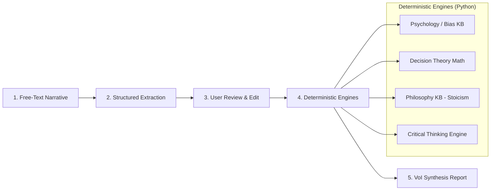

# Phronesis (φρόνησις)

> *"Question the decision. Examine the mind."*

Phronesis is an open, auditable, browser-based decision-reasoning system designed to make a person's cognitive framing, implicit assumptions, philosophical tradeoffs, and mathematical sensitivity explicit before committing to high-stakes choices.

---

## 🧭 What Phronesis Is (and What It Is Not)

| Phronesis Is | Phronesis Is NOT |
| :--- | :--- |
| **A decision-reasoning engine** that illuminates how you are thinking. | **A decision-recommendation engine** that tells you what to choose. |
| **Deterministic & auditable code** evaluating mathematical sensitivity, bias patterns, and philosophical frameworks. | **An LLM making moral, financial, or personal value judgments.** |
| **A cognitive mirror** surfacing hidden assumptions, tradeoffs, and cheap experiments. | **A black-box scoring algorithm** (e.g. *"87/100 → Choose Option A"*). |
| **A human-in-the-loop tool** where the user verifies extracted variables before analysis runs. | **An automated decision oracle** or psychological diagnostic test. |

### Core Architectural Axiom
> **Judgment is never outsourced to an LLM.**  
> LLMs are leveraged exclusively for interface tasks: natural language structured extraction and final report narrative generation. All mathematical models (Expected Utility, Minimax Regret, Sensitivity Analysis), cognitive bias pattern matches, and philosophical framework matrices execute via deterministic, verifiable, unit-tested code.

---

## 🚫 Non-Negotiable Boundaries ("Must Nevers")

1. **Never State a Diagnosis:** Phronesis uses observational pattern language (*"This framing exhibits structural characteristics consistent with loss aversion"*), never diagnostic identity language (*"You suffer from the sunk cost fallacy"*).
2. **Never Claim Mathematical Prescriptiveness:** Formal decision theory tools (Expected Utility, Minimax Regret) are heuristics for stress-testing preferences, not mathematical proofs of what life choices one ought to make.
3. **Never Collapse to a Single Score:** No scalar ratings, composite indices, or binary verdicts.
4. **Never Privilege a Single Philosophical School:** Frameworks (Stoicism, Utilitarianism, Deontology) are lenses that reveal distinct moral vectors, never objective arbiters of right action.
5. **Never Assert Psychological Certainty:** Cognitive biases are flagged as possible risks to inspect, never certain mental states.

---

## 🔄 The 5-Step Pipeline



1. **Free-Text Input:** You describe your real-world dilemma, uncertainties, goals, and constraints in natural language.
2. **Extraction Pipeline:** An LLM extracts a structured JSON representation of options, goals, probabilities, values, and assumptions using strict schema validation.
3. **Interactive Verification:** You review, tweak, and approve the extracted parameters. Downstream logic only runs on confirmed data.
4. **Four Deterministic Analysis Layers:**
   - **Cognitive Bias Pattern Matching:** Sunk cost, confirmation bias, loss aversion, overconfidence, status quo bias.
   - **Decision Theory Math:** Expected Utility calculation, Minimax Regret matrix, and Sensitivity Analysis (finding the parameter inflection threshold where the preferred option flips).
   - **Philosophical Inquiry (Stoic Lens in V1):** Dichotomy of control mapping and indifference categorization.
   - **Critical Thinking:** Assumption falsifiability checks, base-rate prompts, and steelmanned counterarguments.
5. **Value of Information (VoI) Report:** A final synthesis turns raw analytical findings into an actionable report highlighting the **single most sensitive assumption** and the cheapest experiment to test it before deciding.

---

## ⚡ Quickstart

### Prerequisites
- Python 3.11+
- Node.js 18+ and `npm`
- An API key for an LLM provider (e.g., Anthropic Claude / OpenAI / Gemini API)

### 1. Clone & Set Up Backend

```bash
# Clone the repository
git clone https://github.com/your-username/phronesis.git
cd phronesis

# Set up Python virtual environment
cd backend
python3 -m venv venv
source venv/bin/activate
pip install -r requirements.txt

# Configure environment variables
cp .env.example .env
# Edit .env and supply your LLM API Key (e.g., OPENAI_API_KEY or GEMINI_API_KEY)

# Start FastAPI development server
uvicorn app.main:app --reload --port 8010
```

### 2. Set Up Frontend

```bash
cd ../frontend
npm install
npm run dev -- --port 5180
```

Visit `http://localhost:5180` in your browser.

> **💡 Zero-Key Demo Mode:** Phronesis includes built-in, pre-extracted benchmark decisions (e.g., *"Stay in Senior Tech Role vs. Join Early-Stage AI Startup"*) allowing first-time visitors to experience the full deterministic pipeline and report synthesis with zero API configuration.

---

## 🛠 Tech Stack

- **Backend:** Python 3.11, FastAPI, Pydantic v2 (Strict Schema Enforcement), NumPy / SciPy
- **Frontend:** React 18, TypeScript, Tailwind CSS, Recharts (Sensitivity & Regret visualizers), Lucide Icons
- **Data & Knowledge Bases:** Versioned JSON Knowledge Bases (`bias_patterns.json`, `philosophical_frameworks.json`)
- **LLM Interface:** Native Structured Outputs / Tool-Calling API (Gemini / Anthropic / OpenAI)

---

## 📜 Repository Structure

```text
phronesis/
├── README.md               # Overview, quickstart, and foundational philosophy
├── PRD.md                  # Product Requirements & fully worked pipeline example
├── REQUIREMENTS.md         # Functional/Non-functional specifications & Schemas
├── DESIGN.md               # Architecture, layer boundaries, and execution models
├── ROADMAP.md              # 5-Phase build roadmap with Definition of Done
├── backend/
│   ├── app/
│   │   ├── api/            # FastAPI routes
│   │   ├── core/           # Configuration & base settings
│   │   ├── engines/        # Deterministic analysis modules (Math, Bias, Stoicism, Logic)
│   │   ├── knowledge/      # JSON Knowledge bases (Biases, Philosophy)
│   │   ├── schemas/        # Pydantic data schemas
│   │   └── services/       # LLM extraction & synthesis adapters
│   └── tests/              # Comprehensive unit tests for math & matching rules
└── frontend/
    ├── src/
    │   ├── components/     # UI widgets, interactive tables, charts
    │   ├── features/       # Narrative input, extraction editor, report view
    │   ├── lib/            # API client & helper utilities
    │   └── types/          # TypeScript definitions matching Pydantic schemas
    └── public/             # Static assets & benchmark scenarios
```

---

## 📄 License & Governance

Phronesis is open-source under the Apache 2.0 License. It is designed to be fully self-hostable, auditable, and transparent.
