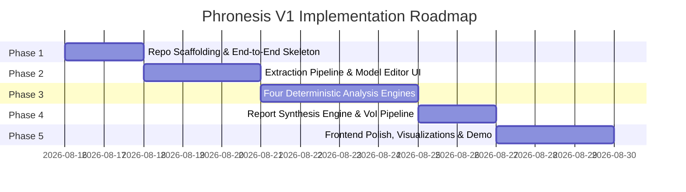

# Phased Implementation Roadmap — Phronesis

This document outlines the 5-phase engineering roadmap for building, verifying, and releasing Phronesis V1.

---

## Roadmap Overview

---

## Phase 1: Foundation, Architecture & Full-Stack Skeleton

### 1.1 Objective
Establish the repository structure, dependency configurations, environment setups, and an end-to-end communication loop between React and FastAPI using stubbed health and pipeline endpoints.

### 1.2 Concrete Tasks
- [ ] **Backend Setup (`backend/`):**
  - Initialize Python 3.11 virtual environment with `pyproject.toml` / `requirements.txt`.
  - Install FastAPI, Uvicorn, Pydantic v2, NumPy, Pytest, Python-dotenv.
  - Configure `app/core/config.py` for environment variables (`LLM_API_KEY`, `LLM_PROVIDER`, `CORS_ORIGINS`).
  - Create stub endpoints in `app/api/v1/` (`/health`, `/extract`, `/analyze`, `/report`).
- [ ] **Frontend Setup (`frontend/`):**
  - Scaffold React + TypeScript project with Vite and Tailwind CSS.
  - Install Recharts, Lucide-React, Axios / Fetch client, and Tailwind typography plugins.
  - Configure API proxy in `vite.config.ts` to forward `/api` requests to `localhost:8000`.
- [ ] **End-to-End Verification:**
  - Build a baseline integration test verifying that a frontend ping reaches FastAPI and renders a mock response.

### 1.3 Definition of Done (DoD)
- [x] Backend runs locally via `uvicorn app.main:app --reload` with zero warnings.
- [x] Frontend runs locally via `npm run dev` and renders a clean skeleton layout.
- [x] `pytest backend/tests` runs and passes with a healthy status code check.
- [x] CI workflow (linting + type checking + test run) configured.

---

## Phase 2: Extraction Pipeline & Model Review UI

### 2.1 Objective
Build the narrative-to-schema extraction engine using strict LLM structured output/tool-calling, accompanied by an interactive frontend review editor where users can inspect and tweak extracted parameters.

### 2.2 Concrete Tasks
- [ ] **Schema Definition (`backend/app/schemas/`):**
  - Define `StructuredDecision`, `Alternative`, `StateOfWorld`, `PayoffCell`, `Assumption`, and `Constraint` in Pydantic v2.
  - Implement validation methods (e.g., state probability sum auto-normalization, utility clamping to $[0, 100]$).
- [ ] **Extraction Service (`backend/app/services/extraction_service.py`):**
  - Implement LLM adapter supporting structured JSON output via function/tool calling.
  - Implement robust system prompt with few-shot examples translating messy prose into structured payoff matrices and explicit assumptions.
  - Add fallback logic with automated error diagnostics if initial extraction fails schema validation.
- [ ] **Interactive Model Review View (`frontend/src/features/editor/`):**
  - Build `DecisionSummaryCard` (statement, goals, constraints).
  - Build `PayoffMatrixGrid` (editable $N \times M$ grid for utilities).
  - Build `ProbabilitySliderBar` (live adjustment of state probabilities with live constraint feedback).
  - Build `AssumptionsList` (tagging testable vs. value-based assumptions).

### 2.3 Definition of Done (DoD)
- [x] Given messy 2-paragraph narrative inputs, the extraction endpoint returns a $100\%$ schema-valid `StructuredDecision` object without runtime crashes.
- [x] User can edit any cell, change probabilities, add/remove assumptions in the UI, and see the state update reactively.
- [x] Unit tests cover extraction edge cases (e.g., missing probabilities, single-option narratives).

---

## Phase 3: Deterministic Analysis Engines

### 3.1 Objective
Implement the four analytical layers as pure, deterministic Python modules with unit tests, knowledge base schemas, and algebraic solvers.

### 3.2 Concrete Tasks
- [ ] **Knowledge Base Files (`backend/app/knowledge/`):**
  - Create `bias_patterns.json` (5 core patterns: Sunk Cost, Loss Aversion, Confirmation Bias, Planning Fallacy, Status Quo Bias with trigger predicates and caveat templates).
  - Create `philosophy_frameworks.json` (Stoic lens: dichotomy of control keyword rules and indifferents matrix).
  - Create `base_rates.json` (Empirical reference classes for common career, business, and timeline assumptions).
- [ ] **Layer 1 — Bias Engine (`backend/app/engines/bias_engine.py`):**
  - Implement pure predicate matching functions detecting sunk-cost keywords, extreme loss-aversion utility asymmetries, and ungrounded certainty.
  - Generate observational caveat messages for each matched pattern.
- [ ] **Layer 2 — Decision Theory & Math Engine (`backend/app/engines/math_engine.py`):**
  - Implement pure vector Expected Utility calculation ($\mathbf{EU} = U \cdot \mathbf{p}$).
  - Implement Minimax Regret matrix generator and regret-minimizing alternative selector.
  - Implement algebraic Sensitivity Analysis solver calculating exact parameter inflection points ($p^*$ and $\Delta U^*$).
- [ ] **Layer 3 — Philosophy Engine (`backend/app/engines/philosophy_engine.py`):**
  - Implement Stoic categorization of assumptions into internal controllables vs. external uncontrollables.
  - Output structured inquiry prompts targeting heavy reliance on external uncontrollables.
- [ ] **Layer 4 — Critical Thinking Engine (`backend/app/engines/critical_thinking_engine.py`):**
  - Implement deterministic assumption falsifiability audit.
  - Implement base-rate comparison algorithm.
  - Connect targeted sub-call (LLM Call 1b) in `app/services/counterargument_service.py` to generate steelmanned counterarguments against the leading alternative.

### 3.3 Definition of Done (DoD)
- [x] 100% unit test coverage for `math_engine.py` verifying EU, Minimax Regret, and Sensitivity calculations against textbook mathematical proofs.
- [x] Pure functions in all 4 engines execute in $<20\text{ ms}$ combined.
- [x] Zero LLM calls in Layers 1, 2, 3, and the deterministic sub-components of Layer 4.

---

## Phase 4: Report Synthesis Engine & VoI Pipeline

### 4.1 Objective
Build the second LLM pass that combines the raw outputs of the four deterministic engines into a coherent, high-impact Value of Information report adhering strictly to non-prescriptive, caveat-driven guidelines.

### 4.2 Concrete Tasks
- [ ] **Synthesis Service (`backend/app/services/synthesis_service.py`):**
  - Construct comprehensive synthesis prompt embedding raw math, bias triggers, Stoic mapping, and falsifiable assumptions.
  - Instruct the model to formulate the terminal section around the **Value of Information (VoI)**: identifying the single most volatile assumption and recommending a cheap real-world test.
- [ ] **Caveat Language & Prescriptiveness Guardrail (`backend/app/core/guardrails.py`):**
  - Implement regex and keyword linter checking for forbidden prescriptive phrases (*"You should"*, *"We recommend"*, *"You have the X fallacy"*, *"Score: X/100"*).
  - Automatically sanitize or re-render raw fallback templates if violations occur.
- [ ] **Full Pipeline Orchestration Endpoint (`POST /api/v1/report/synthesize`):**
  - Connect extraction $\rightarrow$ user confirmation $\rightarrow$ deterministic engines $\rightarrow$ report synthesis into a unified, reliable workflow.

### 4.3 Definition of Done (DoD)
- [x] Generated reports consistently present mathematical sensitivity and VoI experiments without prescribing choices.
- [x] Guardrail unit tests verify that any simulated prescriptive text is successfully flagged and blocked.
- [x] End-to-end processing from confirmed model to final report completes in $<8$ seconds.

---

## Phase 5: Frontend Experience, Visualizations & Polish

### 5.1 Objective
Deliver a refined, responsive web application featuring interactive charts, clear layout hierarchies, and a baked-in zero-key demo mode for public showcase.

### 5.2 Concrete Tasks
- [ ] **Interactive Visualizations (`frontend/src/features/report/`):**
  - Build `SensitivityLineChart` using Recharts to plot $EU$ trajectories across probability distributions ($p \in [0, 1]$) with visual inflection points ($p^*$).
  - Build `RegretHeatmapTable` to visually highlight where maximum psychological risk is concentrated.
- [ ] **Report Presentation Components:**
  - Build `VoIHeroBanner` to spotlight the recommended cheap experiment.
  - Build tabbed or expandable sections for Cognitive Pattern Caveats, Stoic Reflection Prompts, and Critical Thinking Audits.
- [ ] **Zero-Key Benchmark Selector:**
  - Create `public/benchmarks/` with pre-extracted scenarios (e.g. *"Enterprise Staff Engineer vs. AI Startup"*, *"Relocate to New City vs. Stay"*, *"Build Custom Internal Tool vs. Buy SaaS"*).
  - Enable instant one-click analysis runs directly from the homepage without requiring an API key.
- [ ] **Documentation & Public Readiness:**
  - Review and finalize `README.md`, quickstart scripts, and sample environment configurations.
  - Verify accessibility, clean typography, responsive mobile/desktop layouts, and error toast notifications.

### 5.3 Definition of Done (DoD)
- [x] First-time visitor can select a benchmark scenario and view full charts, math, and report in $<1$ second.
- [x] User entering custom free-text receives structured extraction, can edit parameters, and receives full visual report.
- [x] All charts render responsively across desktop and tablet screen sizes.
- [x] `npm run build` and `pytest` pass cleanly with zero errors.
