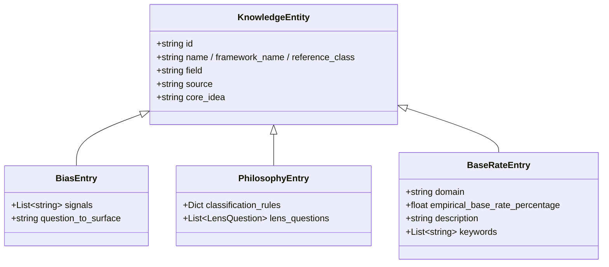
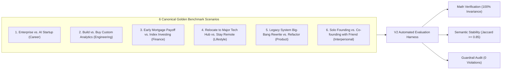
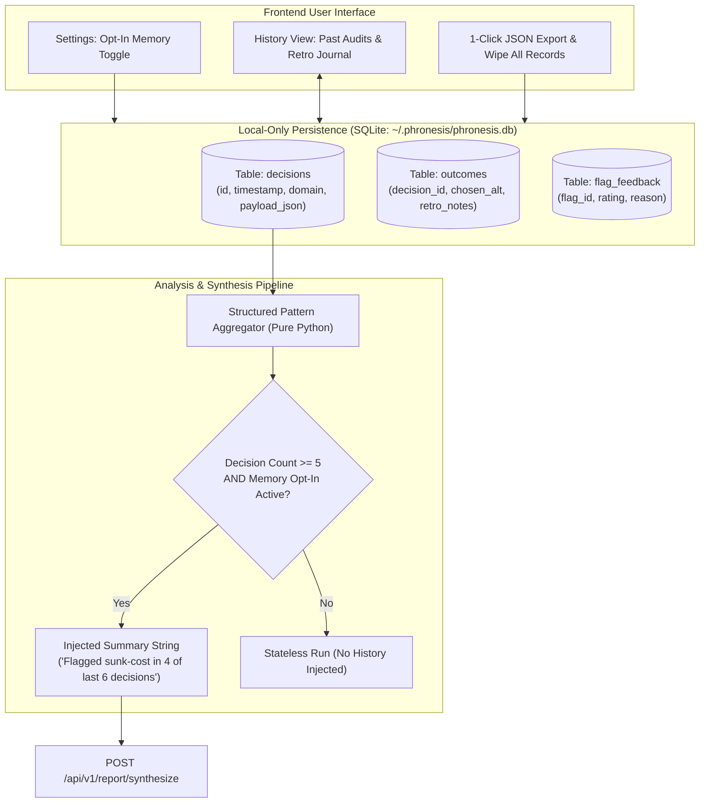
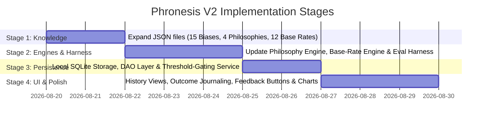

# V2 Architecture Specification: Knowledge, Accuracy, Response Quality & Personalization

> **Document Status:** Architectural Proposal / Planning Pass  
> **Target Version:** Phronesis V2.0  
> **Core Axioms:** Non-negotiable adherence to `DESIGN.md` §3 (no outsourced judgment, provenance for all entries, traceable outputs, strictly observational caveat language, no single scalar scores).

---

## 1. Executive Summary & Unified V2 Vision

Phronesis V1 proved that a **hybrid cognitive pipeline** — combining deterministic analytical engines (pure Python) with constrained LLM schema extraction and template synthesis — can clarify complex human dilemmas without hallucinating advice or abdicating human agency.

V2 unifies four interdependent pillars into a single coherent architectural pass:
```
┌─────────────────────────────────────────────────────────────────────────────┐
│                            PHRONESIS V2 ARCHITECTURE                        │
├───────────────────────────────┬─────────────────────────────────────────────┤
│ 1. Expanded Knowledge Base    │ 15 Biases + 4 Philosophy Lenses + 12 Base   │
│                               │ Rate reference classes (all peer-sourced)   │
├───────────────────────────────┼─────────────────────────────────────────────┤
│ 2. Accuracy & Eval Harness    │ 6 Golden Dilemmas + N-run Jaccard stability │
│                               │ testing + Per-flag UI feedback mechanism    │
├───────────────────────────────┼─────────────────────────────────────────────┤
│ 3. Response Quality & Tone    │ Cross-domain caveat matrix + Structural     │
│                               │ Grounding Tiers (avoiding false precision)  │
├───────────────────────────────┼─────────────────────────────────────────────┤
│ 4. Local Personalization Layer│ Local SQLite store + Hybrid recency/domain  │
│                               │ retrieval + Strict N>=5 threshold-gating    │
└───────────────────────────────┴─────────────────────────────────────────────┘
```

Because **expanded knowledge** alters the matching surface, **accuracy evaluation** requires standardized golden dilemmas, **response quality** must adapt tone across new domains, and **personalization** aggregates historical occurrences of these exact knowledge entities, these four areas share the same underlying data schemas and must be architected as a singular system.

---

## 2. Knowledge Base Expansion & Schema Curation

All knowledge base entries in Phronesis V2 adhere to the established human-curated JSON schema with mandatory `field` and `source` attribution. No entries are generated dynamically at runtime.



---

### 2.1 Cognitive Bias Catalog (`bias_patterns.json`)
Expanded from **5 entries** in V1 to **15 entries** in V2. Each entry represents a structural distortion in human judgment documented in peer-reviewed cognitive psychology or behavioral economics literature.

| # | ID | Name | Field | Primary Source Citation | Core Idea | Trigger Signal Focus |
|---|---|---|---|---|---|---|
| 1 | `sunk_cost` *(V1)* | Sunk Cost Salience | Behavioral Economics | Kahneman & Tversky (1979); Arkes & Blumer (1985) | Weighing unrecoverable past investments into forward choices | Mentions of past tenure, unvested assets, invested capital |
| 2 | `loss_aversion` *(V1)* | Asymmetric Downside Weighting | Behavioral Economics | Tversky & Kahneman (1991) | Losses loom ~2x larger than equivalent gains | Extreme penalty on failure payoff despite safety buffers |
| 3 | `confirmation_bias` *(V1)* | Selective Hypothesis Weighting | Cognitive Psychology | Wason (1960); Nickerson (1998) | Seeking evidence that confirms a favored alternative | High detail on favorite upside, untestable assumptions |
| 4 | `planning_fallacy` *(V1)* | Planning Fallacy / Optimism Skew | Behavioral Economics | Kahneman & Tversky (1979) | Underestimating time, cost, and friction in future execution | >45% success probability on early multi-step endeavors |
| 5 | `status_quo_bias` *(V1)* | Status Quo Inertia | Behavioral Economics | Samuelson & Zeckhauser (1988) | Disproportionate preference to maintain current baseline | Default option favored primarily to avoid transition friction |
| 6 | `anchoring_adjustment` *(NEW)* | Anchoring & Adjustment | Cognitive Psychology | Tversky & Kahneman (1974), *Science* | Over-relying on an initial arbitrary reference number | Payoffs or salary targets fixed to a single historical figure |
| 7 | `availability_heuristic` *(NEW)* | Availability Salience | Cognitive Psychology | Tversky & Kahneman (1973), *Cognitive Psychology* | Overweighting vivid, recent, or emotionally charged events | Heavy focus on a single viral event, recent layoff, or outlier |
| 8 | `framing_effect` *(NEW)* | Gain vs. Loss Framing Skew | Behavioral Economics | Tversky & Kahneman (1981), *Science* | Choices altered solely by whether outcomes are framed as gains or losses | Reversible preference under inverted survival vs. mortality framing |
| 9 | `clustering_illusion` *(NEW)* | Clustering Illusion / Hot Hand | Cognitive Psychology | Gilovich, Vallone, & Tversky (1985) | Treating short-term random streaks as causal trends | Assuming temporary market/revenue surge is permanent trajectory |
| 10 | `survivorship_bias` *(NEW)* | Survivorship Selection Bias | Statistical Methodology | Wald (1943); Brown et al. (1992), *J. Finance* | Evaluating strategies by looking only at surviving success stories | Citing top 0.1% unicorn outcomes as representative precedents |
| 11 | `overconfidence_effect` *(NEW)* | Overconfidence Calibration Gap | Cognitive Psychology | Lichtenstein, Fischhoff, & Phillips (1982) | Subjective confidence systematically exceeds objective accuracy | Narrow 90% confidence bands that omit tail risks |
| 12 | `omission_bias` *(NEW)* | Omission vs. Commission Asymmetry | Moral Psychology | Ritov & Baron (1990), *OBHDP*; Spranca et al. (1991) | Judging harmful active actions worse than equally harmful inaction | Preferring passive decline/stagnation over active failure risk |
| 13 | `endowment_effect` *(NEW)* | Endowment / Divestiture Aversion | Behavioral Economics | Thaler (1980), *JEBO*; Kahneman, Knetsch, & Thaler (1990) | Valuing things one already possesses higher than identical unowned items | Demanding 3x higher utility to surrender an existing asset/title |
| 14 | `hyperbolic_discounting` *(NEW)* | Hyperbolic Present Bias | Behavioral Economics | Ainslie (1975); Laibson (1997), *Q. J. Econ.* | Overweighting immediate payoffs relative to future rewards | Sacrificing 5-year compounding to avoid 30-day discomfort |
| 15 | `outcome_bias` *(NEW)* | Outcome Bias / Hindsight Conflation | Decision Analysis | Baron & Hershey (1988), *JPSP*; Fischhoff (1975) | Judging decision quality solely by outcome rather than prior reasoning | Justifying flawed reasoning because a past gamble happened to pay off |

#### Source Quality & Detection Challenges Flagged:
- **Challenge with `clustering_illusion`:** Pure single-state cross-sectional decisions rarely provide time-series data. The matcher must only flag this when the narrative explicitly cites a recent "streak" (e.g., *"Our sales grew 3 months in a row, proving product-market fit"*).
- **Challenge with `framing_effect`:** Requires identifying whether the user's choice is hypersensitive to negative semantic phrasing rather than mathematical payoffs.

---

### 2.2 Multi-Framework Philosophy Matrix (`philosophy_frameworks.json`)
Expanded from **1 framework** (Stoicism) to **4 parallel philosophical lenses**. Phronesis strictly adheres to the principle: **No philosophical school is privileged or declared correct**. They are presented as distinct evaluative dimensions.

```
┌───────────────────────────────────────────────────────────────────────────┐
│                     FOUR PARALLEL PHILOSOPHICAL LENSES                    │
├─────────────────────────────────────┬─────────────────────────────────────┤
│ 1. Stoic Decision Ethics            │ 2. Utilitarian Consequentialism     │
│    Focus: Dichotomy of Control &    │    Focus: Aggregate Net Utility &   │
│           Preferred Indifferents    │           Multi-Stakeholder Impact  │
├─────────────────────────────────────┼─────────────────────────────────────┤
│ 3. Kantian Deontology               │ 4. Aristotelian Virtue Ethics       │
│    Focus: Categorical Imperative &  │    Focus: Character Cultivation &   │
│           Universalizability        │           The Golden Mean           │
└─────────────────────────────────────┴─────────────────────────────────────┘
```

#### Framework Specifications:

1. **Stoic Decision Ethics (`stoicism_v1`)**
   - *Field:* Hellenistic Philosophy
   - *Source:* Epictetus (*Enchiridion*, *Discourses*); Marcus Aurelius (*Meditations*); Hadot (*The Inner Citadel*)
   - *Core Idea:* The locus of value resides in reasoned choice (*prohairesis*) and personal character. External outcomes, wealth, and status are *indifferents* (*adiaphora*).
   - *Key Inquiries:* Which variables are external uncontrollables? Are you subordinating moral agency to preserve an indifferent?

2. **Utilitarian Consequentialism (`utilitarianism_v1`)**
   - *Field:* Normative Ethics / Consequentialism
   - *Source:* Jeremy Bentham (1789), *An Introduction to the Principles of Morals and Legislation*; J.S. Mill (1861), *Utilitarianism*
   - *Core Idea:* The moral and practical value of an action is determined by its net consequence: maximizing aggregate well-being, utility, and positive experience while minimizing net suffering across all affected parties over the full time horizon.
   - *Classification Rules:*
     - Keywords: `team`, `family`, `stakeholders`, `users`, `employees`, `partner`, `customer`, `community`, `net impact`, `burnout`, `long-term benefit`
   - *Lens Inquiries:*
     - *Aggregate Net Utility:* Considering everyone affected by this decision (partner, team, clients, future self), which alternative produces the highest net balance of flourishing over suffering?
     - *Distributional Fairness:* Does your preferred alternative generate a large benefit for yourself while imposing concentrated, uncompensated downside on someone else?

3. **Kantian Deontology (`kantian_deontology_v1`)**
   - *Field:* Moral Philosophy / Deontological Ethics
   - *Source:* Immanuel Kant (1785), *Groundwork of the Metaphysics of Morals*; Korsgaard (1996), *Creating the Kingdom of Ends*
   - *Core Idea:* Actions have intrinsic moral worth based on adherence to universalizable duties (*Categorical Imperative*). Humans must always be treated as ends in themselves, never merely as instrumental means to an external end.
   - *Classification Rules:*
     - Keywords: `promise`, `obligation`, `duty`, `commitment`, `integrity`, `contract`, `ethics`, `honest`, `leverage someone`, `means to an end`, `universal rule`
   - *Lens Inquiries:*
     - *Universalizability Test:* If every decision-maker in your exact position adopted your underlying decision rule as a universal law, would the system remain coherent, or would it collapse under self-contradiction?
     - *Respect for Persons / Humanity Formulation:* Are you treating any stakeholder (or yourself) merely as an instrumental tool to reach a financial/strategic milestone, rather than as a sovereign individual with inherent dignity?

4. **Aristotelian Virtue Ethics (`virtue_ethics_v1`)**
   - *Field:* Classical Greek Philosophy
   - *Source:* Aristotle (c. 350 BCE), *Nicomachean Ethics*; MacIntyre (1981), *After Virtue*
   - *Core Idea:* Practical wisdom (*phronesis*) and flourishing (*eudaimonia*) are achieved by cultivating stable virtues of character. Virtue exists as the balanced mean between the twin vices of excess and deficiency (e.g., Courage is the mean between Rashness and Cowardice).
   - *Classification Rules:*
     - Keywords: `courage`, `discipline`, `character`, `reputation`, `habits`, `rash`, `timid`, `excess`, `deficiency`, `who i become`, `identity`, `integrity`
   - *Lens Inquiries:*
     - *Character Cultivation:* Independent of whether this venture succeeds or fails, what kind of person or leader will the daily execution of this alternative train you to become?
     - *The Doctrine of the Mean:* Is your proposed action a balanced manifestation of practical wisdom, or does it lean toward an extreme of deficiency (paralyzing caution/timidity) or excess (reckless overreach)?

---

### 2.3 Empirical Base-Rate Library (`base_rates.json`)
Expanded from **3 reference classes** to **12 reference classes** across 4 core life domains.

| # | Reference Class / Domain | Empirical Base Rate | Primary Empirical Source | Domain Keywords |
|---|---|---|---|---|
| 1 | **Seed/Pre-Seed Series A Conversion** *(Tech/Venture)* | 22.0% raise priced Series A | Dealroom / PitchBook Venture Benchmarks (2020–2025) | `startup`, `seed`, `pre-seed`, `series a`, `equity`, `runway` |
| 2 | **Senior Tech Re-employment <90 Days** *(Labor Economics)* | 78.0% re-employed in 90 days | BLS / Tech Talent Mobility Index (2024–2025) | `job search`, `staff engineer`, `layoff`, `re-employment` |
| 3 | **Enterprise Innovation Project Adoption** *(Org Behavior)* | 14.0% get sustained budget | Harvard Business Review / Christensen Innovation Studies | `internal project`, `side project`, `enterprise innovation`, `20% time` |
| 4 | **Executive Career Transition Success** *(Org Behavior)* | 62.0% sustain role >18 months | Corporate Executive Board / Center for Creative Leadership | `executive`, `director`, `vp`, `c-suite`, `head of`, `leadership transition` |
| 5 | **Career Domain Pivot Compensation Parity** *(Labor Economics)* | 54.0% match salary in 12 mo | BLS Occupational Mobility & Transition Longitudinal Data | `career change`, `pivot field`, `new industry`, `retrain` |
| 6 | **Home Renovation Budget Adherence** *(Real Estate/Personal)* | 32.0% finish within budget | Houzz & Home Overview / Joint Center for Housing Studies | `renovation`, `remodel`, `contractor`, `home build`, `property upgrade` |
| 7 | **Active Stock Trading vs. Index Outperformance** *(Finance)* | 8.0% beat S&P 500 over 5 yrs | S&P Indices Versus Active (SPIVA) Scorecard (2024) | `day trading`, `stock picking`, `angel investment`, `beat market` |
| 8 | **Large Software Rewrite Schedule Adherence** *(Software Eng)* | 16.0% deliver on initial time | Standish Group CHAOS Report Benchmarks | `rewrite`, `re-platform`, `legacy migration`, `complete overhaul` |
| 9 | **Early-Stage B2B SaaS Annual Logo Churn** *(Software Eng)* | 18.0% median annual churn | OpenView / KeyBanc SaaS Benchmark Reports | `b2b saas`, `churn rate`, `software subscription`, `customer retention` |
| 10 | **New Habit Adherence > 6 Months** *(Behavioral Science)* | 22.0% maintain active habit | Lally et al. (2010), *European Journal of Social Psychology* | `habit`, `routine`, `daily practice`, `workout`, `writing habit` |
| 11 | **Domestic Long-Distance Relocation Parity** *(Lifestyle)* | 69.0% remain in new city >2 yrs | US Census Bureau Geographic Mobility Studies | `relocate`, `move city`, `new country`, `migration`, `moving abroad` |
| 12 | **Commercial Lease / Brick & Mortar Year-1 Survival** *(Business)* | 72.0% survive 12 months | BLS Business Employment Dynamics Table 7 | `retail store`, `restaurant`, `physical location`, `commercial lease` |

---

## 3. Accuracy, Stability & Evaluation Harness

### 3.1 Layer-Specific Definitions of "Accuracy"
In Phronesis, "accuracy" cannot be measured with a single blunt metric because the four pipeline layers operate under distinct formal conditions:

```
┌─────────────────────────────────────────────────────────────────────────────┐
│                       LAYER-SPECIFIC ACCURACY TAXONOMY                      │
├──────────────────────┬────────────────────────┬─────────────────────────────┤
│ Pipeline Layer       │ Formal Condition       │ Accuracy Definition         │
├──────────────────────┼────────────────────────┼─────────────────────────────┤
│ Layer 2: Math Engine │ Pure Determinism       │ Exact mathematical equality │
│                      │ (No LLM, Closed-form)  │ against analytical proofs   │
├──────────────────────┼────────────────────────┼─────────────────────────────┤
│ Layer 1 & 3: Bias &  │ Constrained Semantic   │ Precision & Recall against  │
│ Philosophy Matching  │ Classification         │ expert-labeled golden sets  │
├──────────────────────┼────────────────────────┼─────────────────────────────┤
│ Layer 4: Critical    │ Deterministic Grading  │ Exact delta formula match & │
│ Thinking Engine      │ + Generative Reasoning │ valid empirical lookup      │
├──────────────────────┼────────────────────────┼─────────────────────────────┤
│ Synthesis & Guardrail│ Constrained Prose      │ 100% Boundary Compliance,   │
│ Layer                │ Generation             │ Zero Prescriptive Leakage   │
└──────────────────────┴────────────────────────┴─────────────────────────────┘
```

1. **Math Layer (Exact):** Pass/Fail. $\mathbf{EU} = U \cdot \mathbf{p}$, Minimax Regret matrix $R$, and algebraic inflection threshold $p_1^*$ must compute with zero floating-point error outside $\epsilon = 10^{-4}$.
2. **Cognitive Bias & Philosophy Matching Layer (Reasonable Classification):** Precision ($\frac{\text{True Flags}}{\text{Total Flags}} \ge 0.85$) and Recall ($\frac{\text{True Flags}}{\text{Expected Golden Flags}} \ge 0.80$).
3. **Critical Thinking Layer:** Falsifiability grading accuracy and absolute base-rate divergence $|\Delta| = |P_{\text{user}} - P_{\text{empirical}}|$.
4. **Synthesis & Guardrails:** Zero regex violations (`validate_text() == True`), zero Stage-2 LLM boundary flags, and 100% sentence-level data provenance.

---

### 3.2 Golden Benchmark Dilemma Suite
Expanded from 2 scenarios to **6 canonical multi-domain test cases**:



1. `tech_career_pivot` *(Career / High Uncertainty)*: Expected Biases: `sunk_cost`, `loss_aversion`, `status_quo_bias`. Expected Philosophy: Stoic dichotomy of control.
2. `saas_build_vs_buy` *(Engineering Strategy)*: Expected Biases: `planning_fallacy`, `confirmation_bias`. Expected Base Rate: Enterprise Innovation / Software Rewrite.
3. `mortgage_vs_investing` *(Personal Finance)*: Expected Biases: `loss_aversion`, `hyperbolic_discounting`, `omission_bias`. Expected Base Rate: Active trading vs Indexing.
4. `relocate_vs_stay` *(Lifestyle & Family)*: Expected Biases: `status_quo_bias`, `endowment_effect`, `availability_heuristic`. Expected Philosophy: Aristotelian Virtue Ethics (Character growth).
5. `rewrite_vs_refactor` *(Architecture / Operational)*: Expected Biases: `planning_fallacy`, `sunk_cost`, `overconfidence_effect`. Expected Base Rate: Large Software Rewrite (16%).
6. `cofounder_vs_solo` *(Interpersonal / Strategic)*: Expected Biases: `omission_bias`, `confirmation_bias`. Expected Philosophy: Kantian Deontology (Respect for persons / agreements) & Utilitarianism (team impact).

---

### 3.3 Multi-Run Stability & Repeatability Protocol
Because LLM classification and synthesis involve temperature ($T \in [0.0, 0.1]$), the harness executes each golden dilemma $N = 5$ times in an automated test script (`backend/tests/test_eval_harness.py`).

#### Evaluation Metrics:
1. **Mathematical Invariance:**
   $$\text{Variance}(\mathbf{EU}) = 0, \quad \text{Variance}(p^*) = 0$$
2. **Classification Jaccard Stability:** For any two runs $A$ and $B$ on the same dilemma:
   $$J(\text{Flags}_A, \text{Flags}_B) = \frac{|\text{Flags}_A \cap \text{Flags}_B|}{|\text{Flags}_A \cup \text{Flags}_B|} \ge 0.85$$
3. **Prescriptive Leakage Rate:**
   $$\text{Violations} = 0 \quad (\text{Strict Stage-1 + Stage-2 Pass})$$

---

### 3.4 Per-Flag UI Feedback Architecture
To allow continuous quality monitoring without heavy external telemetry or privacy-invasive tracking, Phronesis V2 introduces a lightweight, local-only feedback widget on each surfaced card in the report view.

```
┌────────────────────────────────────────────────────────────────────────┐
│ [Card: Sunk Cost Salience]                                 [👍] [👎]   │
│ Stated reasoning incorporates $120k unvested equity...                 │
│                                                                        │
│ (If 👎 clicked, small popover appears):                                │
│   Select reason:                                                       │
│   ( ) Spurious flag / Doesn't apply                                    │
│   ( ) Trigger misidentified                                            │
│   ( ) Overly aggressive tone                                           │
│   [Save Feedback]                                                      │
└────────────────────────────────────────────────────────────────────────┘
```

- **Storage:** Persisted locally to SQLite table `flag_feedback` (or local JSON store).
- **Purpose:** Flags can be queried via `GET /api/v1/analytics/feedback-summary` to inspect which bias or philosophy patterns produce false-positive friction.

---

## 4. Response Quality, Caveat Nuance & Grounding Tiers

### 4.1 Cross-Domain Caveat Language Testing Matrix
Different decision domains require subtle adaptations in tone while strictly preserving observational neutrality.

| Domain | Potential Tone Failure Mode | Calibrated Neutral Caveat Formulation |
|---|---|---|
| **Career / Tech** | Overly aggressive corporate jargon; dismissive of tenure | *"The model notes past tenure and unvested equity as explicit inputs. Economically, unrecoverable past investments cannot be altered by future choices."* |
| **Personal Finance** | Clinical coldness; lecturing on market efficiency | *"Your stated preferences heavily penalize downside uncertainty relative to historical index return distributions."* |
| **Lifestyle / Family** | Intrusive pseudo-psychological assumptions | *"The stated goals reflect a preference for geographical familiarity, which often balances transition friction against new location upside."* |
| **Interpersonal / Co-founding** | Prescriptive moralizing on personal relationships | *"The framing evaluates trade-offs between shared execution risk and individual autonomous ownership."* |

---

### 4.2 Signal Strength: Flat Binary vs. False Precision vs. Structural Grounding Tiers

```
┌─────────────────────────────────────────────────────────────────────────────┐
│            ARCHITECTURAL EVALUATION: HOW TO REPRESENT SIGNAL STRENGTH       │
├──────────────────────────┬──────────────────────────────────────────────────┤
│ Approach                 │ Architectural Evaluation                         │
├──────────────────────────┼──────────────────────────────────────────────────┤
│ Option A: Flat Binary    │ Simple, but treats a 1-word mention the same as  │
│ (Flagged vs Not Flagged) │ a central structural pillar of the decision.     │
├──────────────────────────┼──────────────────────────────────────────────────┤
│ Option B: Numerical      │ ❌ REJECTED: Violates Principle #5 ("Never Assert│
│ Confidence (e.g. 84%)    │ Certainty") and Principle #3 ("No Single Scores")│
│                          │ Implies a fake psychometric meter on human mind. │
├──────────────────────────┼──────────────────────────────────────────────────┤
│ Option C: Structural     │ ✅ RECOMMENDED: Classifies signals by *where*    │
│ Grounding Tiers          │ they live in the verified structured model       │
│                          │ (Explicit Variable vs. Narrative Nuance).        │
└──────────────────────────┴──────────────────────────────────────────────────┘
```

#### Recommendation & Detailed Justification: Structural Grounding Tiers
Instead of pseudo-scientific numerical confidence scores (e.g., *"Confidence: 87%"*), Phronesis V2 adopts **Two Qualitative Structural Grounding Tiers**:

1. **`Tier 1: Explicit Model Variable` (Primary Grounding):**
   - The signal is directly tied to a quantitative parameter or explicit assumption in the confirmed structured model (e.g., an unvested equity dollar value entered in the payoff matrix, or a stated probability of 90% that exceeds an empirical base rate).
   - *UI Badge:* `Explicit Variable`
2. **`Tier 2: Narrative Nuance` (Secondary Grounding):**
   - The signal arises from descriptive language, goals, or stated unknowns in the narrative text (e.g., words like *"worry"*, *"fear"*, *"streak"*).
   - *UI Badge:* `Narrative Nuance`

**Why this matters:** This distinction is 100% mathematically and structurally honest. It tells the user *why* an item was surfaced without falsely claiming to know the inner probabilistic state of their psyche.

---

## 5. Personalization & Local Memory Layer (Executing `DESIGN.md` §6)

As originally architected in `DESIGN.md` §6, Phronesis V2 implements a **selective retrieval-based memory system**, not an unbounded context-window chat transcript.



---

### 5.1 Local-Only Persistence Architecture (SQLite)
Phronesis is a personal, self-hosted decision studio. Multi-tenant cloud databases and authentication overhead are strictly omitted in favor of a robust, zero-dependency local SQLite file:
- **Default Database Path:** `~/.phronesis/phronesis.db` (configurable via `.env`).
- **Engine:** Python built-in `sqlite3` with Write-Ahead Logging (`PRAGMA journal_mode=WAL;`).
- **Zero-Network Isolation:** All decision history remains on the user's local disk.

#### Database Schema:
```sql
CREATE TABLE IF NOT EXISTS decisions (
    id TEXT PRIMARY KEY,
    timestamp TEXT NOT NULL,
    domain TEXT NOT NULL,
    decision_statement TEXT NOT NULL,
    structured_decision_json TEXT NOT NULL,
    analysis_bundle_json TEXT NOT NULL,
    report_markdown TEXT NOT NULL,
    key_sensitive_variable TEXT,
    preferred_eu_alt TEXT,
    minimax_regret_choice TEXT,
    flagged_bias_ids TEXT -- Comma-separated list of IDs e.g. "sunk_cost,loss_aversion"
);

CREATE TABLE IF NOT EXISTS decision_outcomes (
    id TEXT PRIMARY KEY,
    decision_id TEXT NOT NULL,
    recorded_at TEXT NOT NULL,
    chosen_alternative_id TEXT NOT NULL,
    actual_utility_rating REAL, -- 0.0 to 100.0 subjective retrospective score
    retrospective_notes TEXT,
    FOREIGN KEY (decision_id) REFERENCES decisions(id) ON DELETE CASCADE
);

CREATE TABLE IF NOT EXISTS flag_feedback (
    id TEXT PRIMARY KEY,
    decision_id TEXT NOT NULL,
    flag_id TEXT NOT NULL,
    flag_type TEXT NOT NULL, -- "bias" or "philosophy"
    is_positive INTEGER NOT NULL, -- 1 = Helpful, 0 = False Positive
    feedback_reason TEXT,
    created_at TEXT NOT NULL
);

CREATE TABLE IF NOT EXISTS user_settings (
    key TEXT PRIMARY KEY,
    value TEXT NOT NULL
);
```

---

### 5.2 Retrieval Logic & Context Synthesis
When analyzing a new decision, the retrieval engine executes a **Hybrid Recency + Domain-Similarity** query:

1. **Recency Window:** Extracts the last $N = 10$ decisions across all domains to compute global cognitive habits.
2. **Domain-Specific Subset:** Extracts the last $M = 5$ decisions within the *same domain* (e.g. `career` or `personal_finance`).
3. **Structured Compression:** The raw text of past decisions is **never** dumped into the prompt. Instead, pure Python aggregates recurrence frequencies into a concise context block:

```text
[LONGITUDINAL PATTERN CONTEXT (Local Storage)]:
- Total Decisions Logged: 8 (5 Career, 3 Finance)
- Recurring Cognitive Signals: 'sunk_cost' was flagged in 4 of your last 6 decisions; 'planning_fallacy' in 3 of 6.
- Base-Rate Calibration: In past decisions, estimated success probabilities exceeded historical base rates by an average of +19.4%.
- Outcome Follow-ups: 2 past decisions logged outcomes (Alternative chosen matched Minimax Regret in both).
```

---

### 5.3 Strict Threshold-Gating ($N \ge 5$)
To protect against premature pattern matching from small sample noise ($N = 1$ or $N = 2$), Phronesis enforces a strict gate in `app/services/synthesis_service.py`:

```python
if decision_count < 5 or not is_memory_opted_in():
    # Pass empty longitudinal context to report synthesis
    longitudinal_summary = None
```

Cross-decision insights are only generated when $\ge 5$ verified records exist.

---

### 5.4 Sovereign Consent, Export, & Purge Controls
In adherence to `DESIGN.md` §6:
1. **Opt-In by Default:** Storing decisions and longitudinal pattern synthesis is **disabled** out of the box. Users must toggle "Enable Local Decision Memory" in the application settings.
2. **View & Edit History:** Users can browse full past decisions, view the original balance scale sensitivity and payoffs, and add retrospective outcome notes.
3. **One-Click Export:** A single click in the UI triggers `GET /api/v1/history/export`, downloading a full JSON package (`phronesis_history.json`).
4. **Instant Wipe:** `POST /api/v1/history/purge` irreversibly deletes all SQLite tables, leaving the local instance completely stateless.

---

## 6. Implementation Phasing & Architecture Alignment

The implementation of V2 will follow a clean, four-stage buildout:



---

## 7. Open Questions & Design Decisions for User Review

> [!IMPORTANT]
> **Key Decisions Confirmed in this Architecture:**
> 1. **Signal Strength Formulation:** We recommend **Structural Grounding Tiers** (`Explicit Variable` vs `Narrative Nuance`) rather than pseudo-scientific numerical percentages (e.g. "87% confidence"), because numerical scores violate the core axiom against false precision.
> 2. **Storage Solution:** Local SQLite (`~/.phronesis/phronesis.db`) with WAL mode is specified instead of multi-tenant cloud databases, keeping the project 100% private, sovereign, and self-hosted.
> 3. **Philosophy Parity:** All 4 frameworks (Stoicism, Utilitarianism, Kantian Deontology, Aristotelian Virtue Ethics) are evaluated side-by-side without declaring any framework superior.
